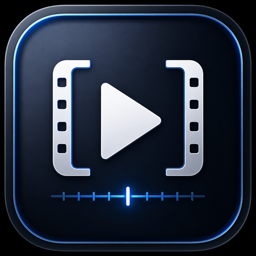
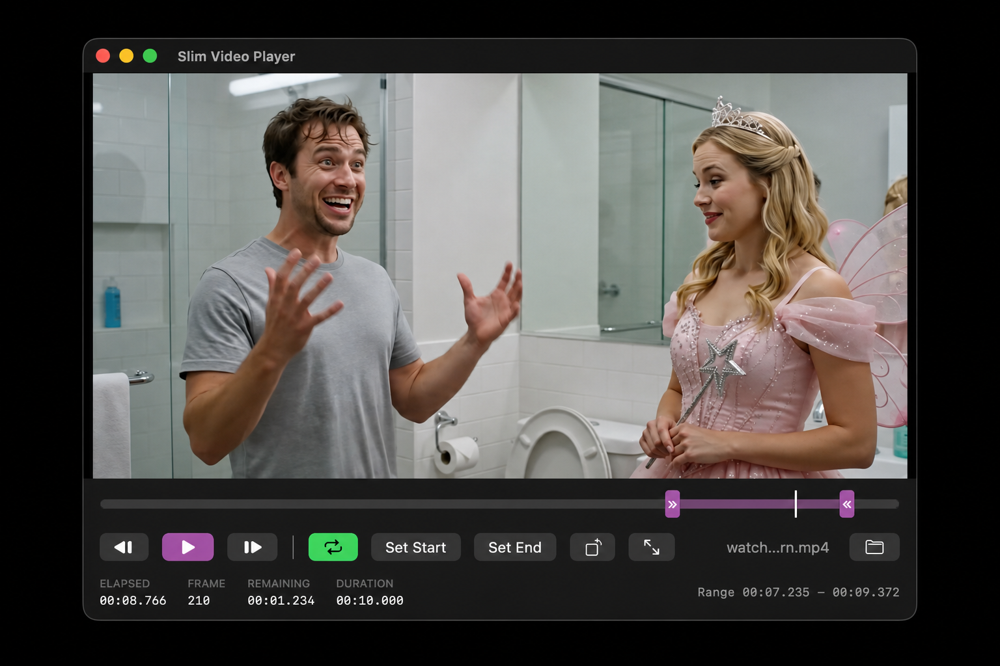

<p align="center">
  
</p>

# Slim Video Player

Slim Video Player is a focused, native macOS app for inspecting MP4 video files.
It uses SwiftUI and AVFoundation, keeps playback controls out of the video area,
and makes it easy to review an exact range one frame at a time.



## Features

### Opening videos

- Opens local MP4 files with the Open button or **File > Open Video…** (`⌘O`).
- Accepts MP4 files dragged from Finder onto the app window.
- Starts playback immediately after a video loads.
- Resets repeat, rotation, and the playback range whenever a new file is opened.
- Shows the open file's name in the control bar.

### Playback controls

- Plays and pauses with the main control or the Space bar.
- Rotates the displayed video 90 degrees counterclockwise with each press of the
  rotate button.
- Enters a full-screen view with the full-screen button, `Control-Command-F`,
  or by double-clicking the video. Full-screen mode hides the controls, menu
  bar, and Dock; `Esc` restores the standard window.
- Moves exactly one nominal video frame backward or forward while paused.
  The Left and Right arrow keys provide keyboard access to frame stepping.
- Uses frame-accurate seeks for timeline movement and frame stepping.
- Displays the current elapsed time, calculated frame number, remaining time,
  and total duration. Times include millisecond precision.

### Timeline and playback range

- Shows the current playhead position across the full video.
- Supports clicking or dragging anywhere on the timeline to seek while playing
  or paused.
- Provides blue start and end handles for selecting a playback range.
- Includes **Set Start** and **Set End** buttons that set the corresponding
  range boundary to the current playback position.
- Clamps seeking and frame stepping to the selected range.
- Cycles the repeat button through three modes:
  - **Off** stops at the selected range end and is selected for every new video.
  - **From Start** restarts playback at the selected range start.
  - **Bounce** uses an orange button. Forward playback switches to reverse at
    the range end, and reverse playback switches to forward at the range start.
    Reverse frames are decoded into short, prefetched windows for smooth
    playback even when the MP4 uses inter-frame compression.
- Displays the selected range's exact start and end times below the timeline.

The range selection is non-destructive. Slim Video Player never edits or
rewrites the original video.

## Requirements

- macOS 14 or later
- Xcode 16 or a compatible Swift 6 toolchain

## Build the macOS app

Open `SlimVideoPlayer.xcodeproj` in Xcode, select the `SlimVideoPlayer` scheme,
and press `Command-R`. This builds and launches a conventional macOS
application with its own Dock and Finder icon.

To create a release build from the command line:

```sh
xcodebuild \
  -project SlimVideoPlayer.xcodeproj \
  -scheme SlimVideoPlayer \
  -configuration Release \
  -derivedDataPath .build/xcode \
  build
```

The application is placed at:

```text
.build/xcode/Build/Products/Release/SlimVideoPlayer.app
```

You can also use **Product > Archive** in Xcode to sign and distribute the app.

The Swift package remains available for development from Terminal:

```sh
swift run SlimVideoPlayer
```
